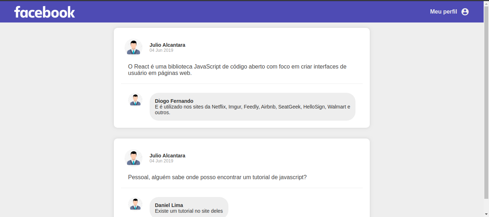

## Clone do facebook

### Sobre a aplicação

Aplicação criada do zero utilizando Webpack, Babel, Webpack Dev Server e ReactJS.

Nessa aplicação foi desenvolvida uma interface semelhante com a do Facebook utilizando React.

As informações contidas na interface são estáticas e não refletem nenhuma API REST ou back-end.

### Tela da aplicação
